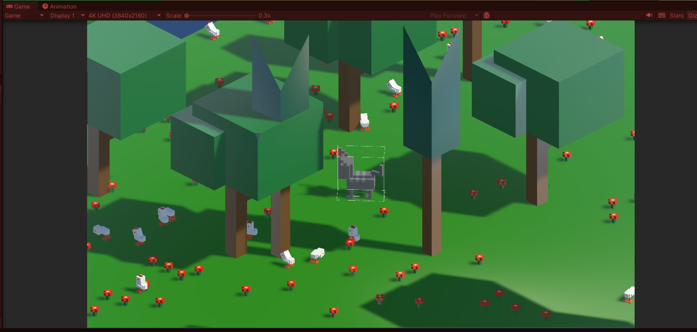

<H1 style="text-align:center" = "text-aline:center" >Abstract Fabric Demo</H1>

<H4 style="text-align:center" = "text-aline:center" >Description</H4>

A small 3D scene that implements the Abstract Factory pattern and the State Machine pattern
